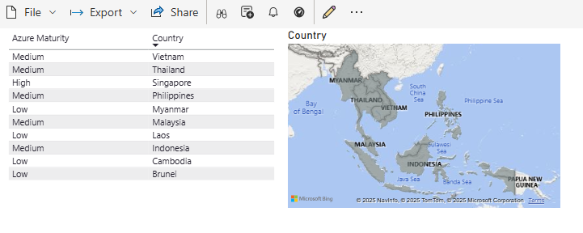

# ASEAN Cloud Maturity Overview
Example result:
#### General View | ASEAN

#### Targetd View | Phillipines

## Goal
This project provides a visual map of ASEAN countries and their **cloud maturity levels**.  
The purpose is to **showcase cloud adoption trends** across the region and their geographical locations.

---

## Technology Stack
- **Power BI** – For interactive dashboards and visualization.
- **Azure SQL Database** – To store structured data for reporting.
- **Azure Data Explorer** – For advanced querying and analytics.
- **SQL** – For data manipulation and integration.

---

## Use Case
- Display **cloud maturity rankings** for ASEAN countries:
  - **Low**
  - **Medium**
  - **High**
- Rankings are based on **general consensus** and **not precise measurements**.
- Designed as a **basic tutorial** for beginners learning:
  - Power BI fundamentals
  - SQL Database integration

---

## Future Improvements
- **Power Apps** – Enable end users to update data directly.
- **Power Automate** – Automate workflows for report refresh and notifications.

---

## Key Notes
- This is an **introductory guide**, not an authoritative benchmark.
- Intended for **learning purposes** and **hands-on practice**.
